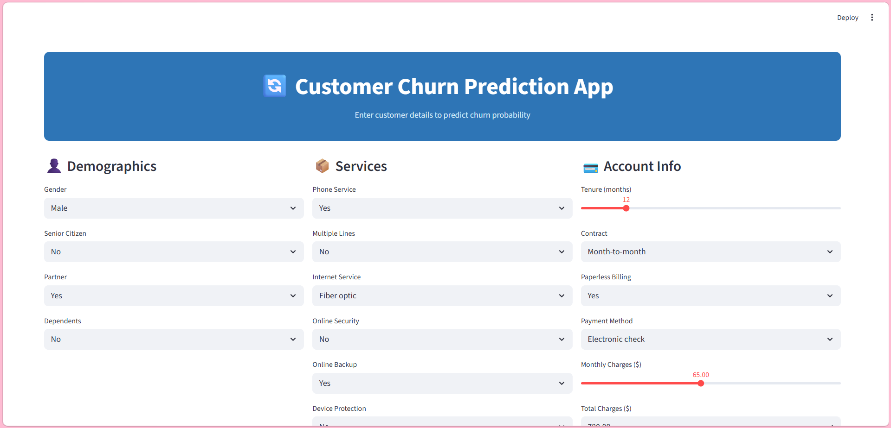
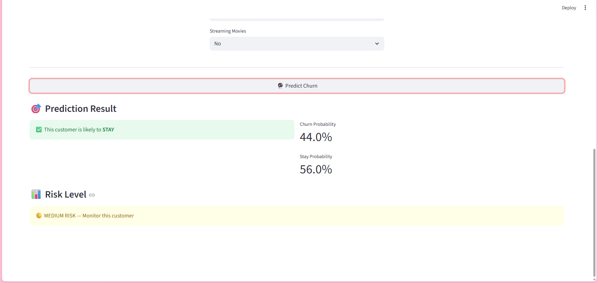
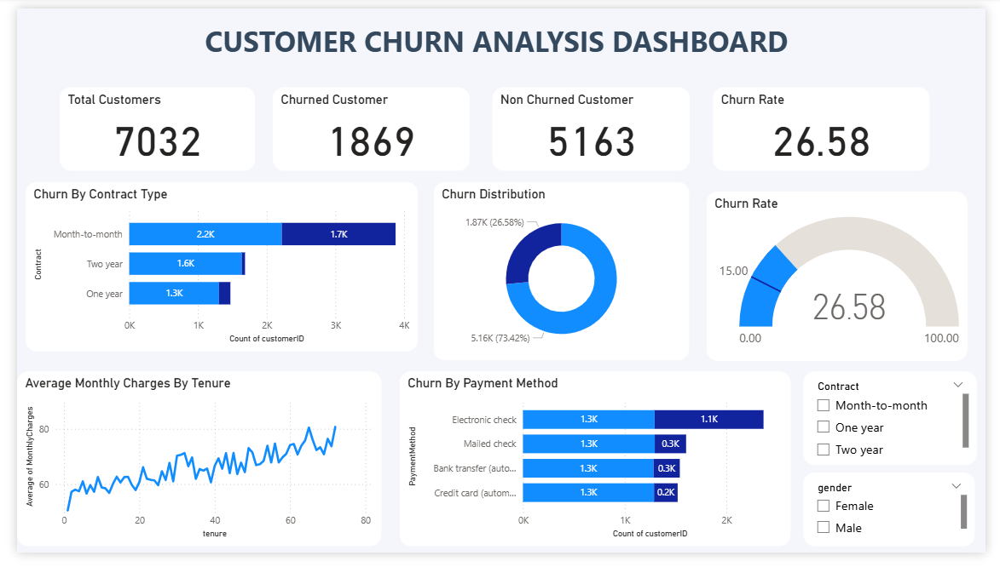
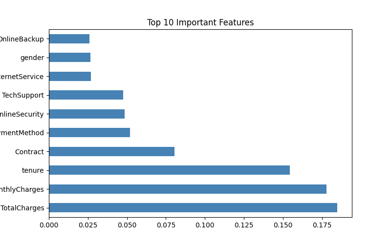
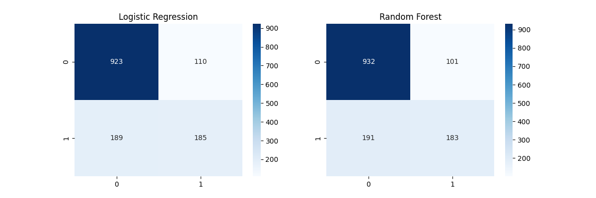

# 🔄 Customer Churn Prediction

[](https://veenaa-churn-prediction.streamlit.app)

---

An end-to-end **Data Analytics and Machine Learning** project that predicts customer churn using the **Telco Customer Churn Dataset**. This project demonstrates the complete analytics workflow—from SQL-based business analysis and exploratory data analysis (EDA) to Machine Learning, Power BI dashboard development, and deployment with Streamlit.

---

# 📌 Project Overview

Customer churn is one of the biggest challenges faced by subscription-based businesses. Understanding why customers leave helps organizations improve customer retention and reduce revenue loss.

This project analyzes customer behavior, identifies churn patterns, and predicts whether a customer is likely to churn using a **Random Forest Classifier**.

---

# 🎯 Project Objectives

- Analyze customer churn trends using SQL.
- Perform Exploratory Data Analysis (EDA) using Python.
- Build and evaluate a Machine Learning classification model.
- Develop an interactive Power BI dashboard.
- Deploy a Streamlit web application for real-time customer churn prediction.

---

# 🛠️ Tech Stack

- Python
- Pandas
- NumPy
- Matplotlib
- Seaborn
- Scikit-learn
- SQL (MySQL)
- Power BI
- Streamlit
- Joblib
---

# 📂 Project Structure

```text
customer-churn-prediction/
│
├── app/
│   ├── app.py
│   └── churn_model.pkl
│
├── data/
│   ├── raw/
│   ├── cleaned/
│   └── visuals/
│
├── notebooks/
│   ├── eda.ipynb
│   └── model.ipynb
│
├── powerbi/
│   └── churn_dashboard.pbix
│
├── sql/
│   └── queries.sql
│
├── requirements.txt
├── .gitignore
└── README.md
```
---

# 📊 SQL Analysis

SQL was used to analyze customer behavior and identify key business insights before building the machine learning model.

### SQL Queries Performed

- Overall Customer Churn Rate
- Churn by Contract Type
- Average Monthly Charges by Churn Status
- Churn by Tenure Group
- Top Payment Methods among Churned Customers

### Key Business Insights

- Overall churn rate: **26.58%**
- Customers with **Month-to-Month contracts** showed the highest churn.
- Customers with **higher monthly charges** were more likely to churn.
- Customers with **shorter tenure** exhibited significantly higher churn rates.
- **Electronic Check** was the most common payment method among churned customers.
---

# 📈 Exploratory Data Analysis (EDA)

Exploratory Data Analysis was performed to understand customer behavior and identify factors associated with churn.

### Visualizations Created

- Customer Churn Distribution
- Churn by Contract Type
- Monthly Charges vs Churn
- Tenure vs Churn
- Correlation Heatmap

### Key Findings

- Approximately **26.6%** of customers had churned.
- Customers with Month-to-Month contracts had the highest churn.
- Customers with higher monthly charges tended to churn more frequently.
- Customers with lower tenure were significantly more likely to leave.
- Correlation analysis highlighted relationships between customer demographics, subscribed services, and churn behavior.
---

# 🤖 Machine Learning

## Model Development

The cleaned dataset was preprocessed and multiple classification algorithms were evaluated. The **Random Forest Classifier** was selected as the final model because it provided the best overall performance for customer churn prediction.

## Model Performance

| Metric | Score |
|---------|-------|
| Accuracy | **79.25%** |
| Precision | **0.64** |
| Recall | **0.49** |
| F1-Score | **0.56** |

## Model Evaluation

The model was evaluated using:

- Classification Report
- Confusion Matrix
- Feature Importance Analysis
- Probability-based Predictions

### Top Predictive Features

The Random Forest model identified the following features as the most influential in predicting customer churn:

- Total Charges
- Monthly Charges
- Tenure
- Contract Type
- Payment Method
- Online Security
- Tech Support

These features provide valuable business insights into the factors that contribute most to customer churn.
---

# 📊 Power BI Dashboard

An interactive Power BI dashboard was developed to visualize customer churn trends and business insights.

### Dashboard Features

- Overall Churn Rate
- Customer Segmentation
- Contract Type Analysis
- Monthly Charges Analysis
- Tenure Analysis
- Interactive Filters and KPIs

The dashboard enables business users to quickly identify churn patterns and make data-driven decisions.
---

# 🌐 Streamlit Web Application

A Streamlit application was developed to provide real-time customer churn prediction.

### Application Features

- User-friendly interface
- Customer information input form
- Real-time churn prediction
- Churn probability
- Stay probability
- Risk level classification (Low, Medium, High)

The application allows users to enter customer details and instantly receive churn predictions along with risk assessment.
---

# 📷 Project Screenshots

## Streamlit Application



---

## Prediction Result



---

## Power BI Dashboard



---

## Feature Importance



---

## Confusion Matrix


---

# 🚀 Installation

## 1. Clone the Repository

```bash
git clone https://github.com/veenaa-p/customer-churn-prediction.git
```

## 2. Navigate to the Project

```bash
cd customer-churn-prediction
```

## 3. Install Required Libraries

```bash
pip install -r requirements.txt
```

## 4. Run the Streamlit Application

```bash
streamlit run app/app.py
```
---

# 🔮 Future Improvements

- Improve model performance through hyperparameter tuning.
- Compare additional algorithms such as XGBoost and LightGBM.
- Deploy the application on Streamlit Community Cloud.
- Integrate a live database for real-time predictions.
- Add explainable AI techniques (e.g., SHAP) for better model interpretability.
  ---

# 👩‍💻 Author

**Veena P**

Data Analyst | Python | SQL | Power BI | Machine Learning | Streamlit

📧 Feel free to connect and explore my projects on GitHub.

